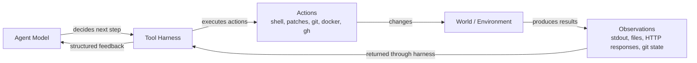
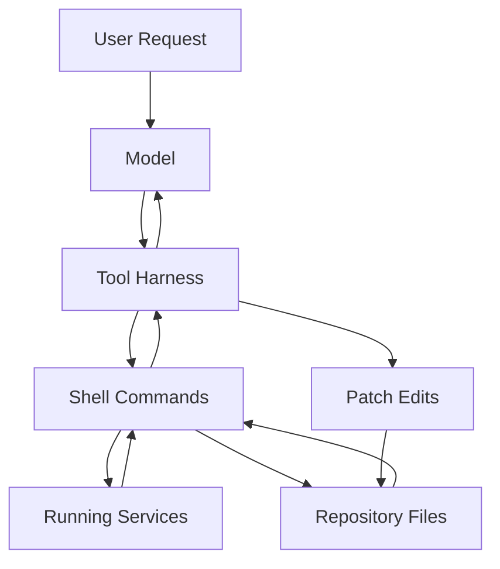
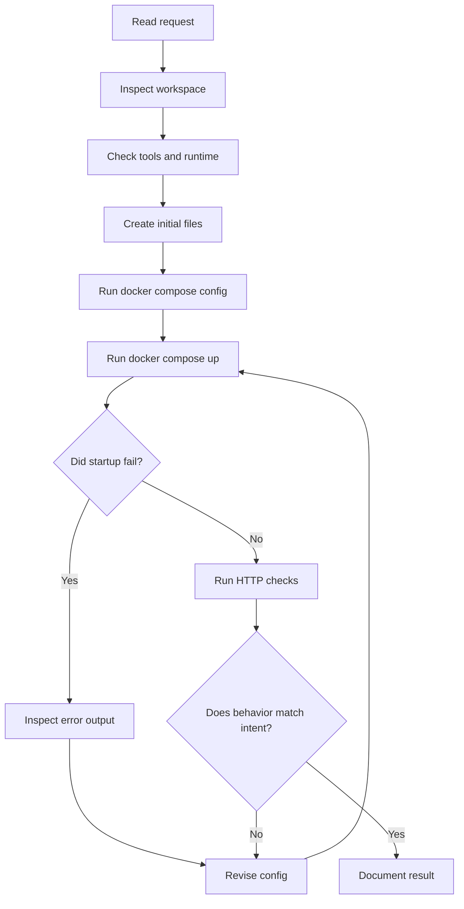
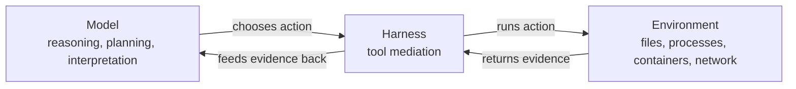

# AI Agent Trace

This document explains how the solution in this repository was produced by an AI coding agent working through a tool harness.

It is not just a build log. It is an educational model of how an agent like this one operates in practice.

## Core Idea

An AI coding agent does not directly "live inside" the codebase.

It works in a loop:

1. read signals from the environment
2. form a working hypothesis
3. take an external action through tools
4. observe the result
5. revise the plan
6. repeat until the task is complete

That loop is the important idea to understand.

## Figure 1: Agent and Environment Loop

The user-provided sketch can be expressed more formally like this:

## What "The Harness" Means

The model itself is not a shell, not a filesystem driver, and not Docker.

The harness is the layer that gives the model controlled capabilities such as:

- running shell commands
- reading command output
- editing files through patches
- querying web resources when needed
- sending progress messages

In this session, the important capabilities were:

- `exec_command`: inspect the repo and run Docker, Git, and GitHub CLI commands
- `apply_patch`: write and update project files
- progress updates: report what was being done and why

## Figure 2: Practical Control Surface

## What Happened In This Session

The solution emerged from repeated observe-act-adjust cycles, not from one perfect plan produced up front.

### Phase 1: Understand the request

The task was to:

- rebuild the original idea as something simpler
- ensure it actually works as microservices
- run it under Docker Compose

The important interpretation step was:

- optimize for reliability and minimalism, not for framework completeness

That is why the frontend was simplified from React/Vite to static HTML/JS served by Nginx.

### Phase 2: Inspect the local environment

The agent first checked:

- current directory contents
- whether the workspace already had files
- whether Docker was installed
- whether Python was installed
- whether Node was installed

This matters because an agent should not assume the environment matches the user's description.

### Phase 3: Build a minimal working hypothesis

The working design became:

- `db` for persistence
- `api` for business logic
- `frontend` for the page and reverse proxy

That shape preserved the microservices requirement while staying as small as possible.

### Phase 4: Materialize the design into files

The agent then created:

- backend application code
- frontend page code
- Dockerfiles
- Compose configuration
- a minimal README

At this point, the system existed as code, but not yet as a verified running system.

### Phase 5: Validate instead of assuming

The agent ran:

- `docker compose config`
- `docker compose up --build -d`

This is a critical lesson.

A useful coding agent does not stop at "the files look correct." It tries to execute the solution in the real environment whenever feasible.

### Phase 6: Encounter real-world friction

The initial startup failed because:

- host port `8000` was already allocated

After that fix, startup failed again because:

- host port `8080` was already allocated

These are exactly the kinds of environment-specific issues that a static code generator would miss if it never validated execution.

### Phase 7: Adapt the design based on observations

The agent revised the implementation:

- removed host publishing for the API
- kept the API internal to Compose
- changed the frontend publishing strategy to use a dynamic host port

Notice the pattern:

- observe failure
- identify the actual constraint
- change the design
- rerun the system

This is the real operational loop of agentic coding.

### Phase 8: Verify the application behavior

After the containers came up, the agent tested:

- frontend HTML delivery
- `GET /api/paradigms`
- `POST /api/paradigms/1/vote`
- follow-up `GET /api/paradigms`

That verified:

- service connectivity
- seed data creation
- database writes
- UI-to-API proxying
- ordering after vote mutation

## Figure 3: Real Session Loop

## Why the Agent Needed Tools

Without tools, the model could only describe a possible solution.

With tools, it could:

- inspect the real filesystem
- discover that the workspace was empty
- detect port conflicts on the actual machine
- build containers
- make live HTTP requests
- write files incrementally

This distinction is essential.

There is a large difference between:

- "I can imagine code that should work"
- "I ran the system and confirmed that it works here"

## What The Model Contributed

The model's job was not to execute commands by itself. Its job was to provide the reasoning that chooses the next action.

That reasoning included:

- simplifying the original stack to reduce failure surface
- deciding to hide the API behind the frontend proxy
- interpreting Docker errors
- converting those errors into concrete configuration changes
- deciding what documentation would help the user understand both the software and the process

## What The Environment Contributed

The environment supplied the facts that the model could not safely invent:

- the workspace was empty
- Docker was available
- `gh` was authenticated
- ports `8000` and `8080` were already occupied
- the assigned frontend host port was `57881`
- the running HTTP responses matched the expected behavior

The agent became useful by combining its planning with those external facts.

## Figure 4: Separation of Roles

## Why This Matters For Education

If students only see the final code, they miss the most instructive parts:

- how the solution was narrowed
- what assumptions failed
- how validation changed the design
- why tooling matters for agentic coding

The educational value is in the loop, not just in the artifact.

## Limits Of An AI Coding Agent

An agent like this is useful, but it is not magical.

It has limits:

- it only knows what the harness exposes
- it can make wrong assumptions if it skips validation
- it depends heavily on the quality of tool feedback
- it can propose code that looks plausible but fails in a real environment if not tested

That is why disciplined tool use matters.

## Good Practices For Working With Agents

- ask for a thin slice before asking for a platform
- require the agent to validate the system, not just write files
- keep boundaries simple so failures are easier to isolate
- treat runtime errors as design information
- ask for a trace document when you want educational value, not just delivery

## Concrete Takeaway From This Repo

This repository demonstrates two loops at once:

### Software loop

- write service
- run service
- test behavior
- adjust architecture

### Agent loop

- observe environment
- choose next action
- execute through tools
- inspect evidence
- revise plan

Those two loops are coupled. That coupling is what makes AI coding agents useful in practice.
