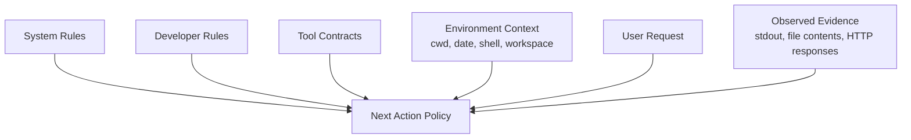
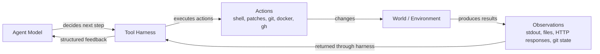
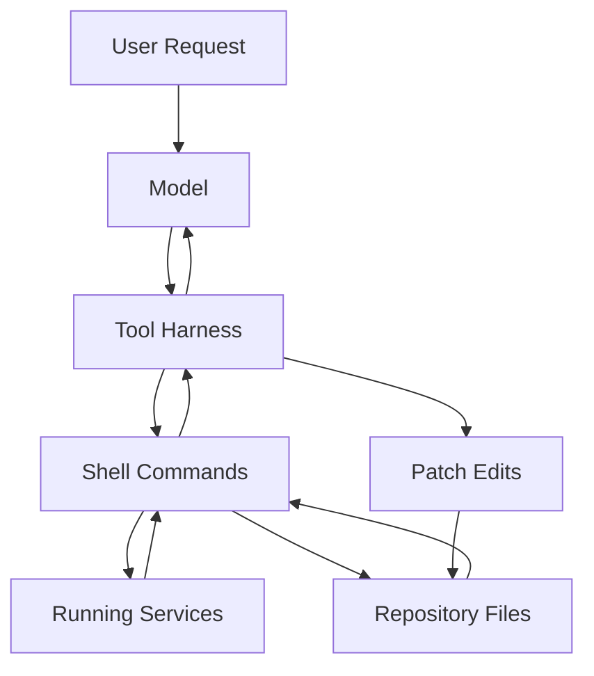
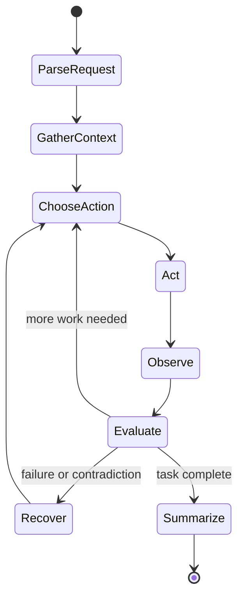
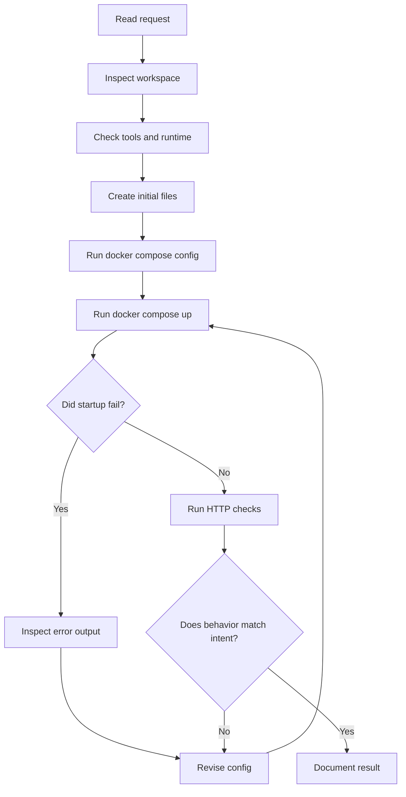
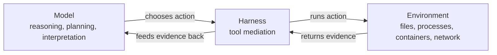

# AI Agent Trace

This document explains how the solution in this repository was produced by an AI coding agent working through a tool harness.

It is not just a build log. It is an educational model of how an agent like this one operates in practice.

## Scope Of This Trace

This trace goes deeper than a normal build log, but it still has an important boundary.

It can show:

- the instruction hierarchy that shaped behavior
- the tools available to the agent
- the observable inputs and outputs of each step
- the decision summaries that explain why the next action was chosen
- the runtime adaptation loop after errors and new evidence

It does not expose:

- hidden token-by-token chain-of-thought
- internal raw deliberation traces
- private training-time signals

That distinction matters. A good agent trace is not a dump of hidden thoughts. It is a structured account of constraints, observations, actions, and policy shifts across the session.

## Core Idea

An AI coding agent does not directly "live inside" the codebase.

It works in a loop:

1. read signals from the environment
2. form a working hypothesis
3. take an external action through tools
4. observe the result
5. revise the plan
6. repeat until the task is complete

That loop is the important idea to understand.

## Prompt Stack And Control Hierarchy

At runtime, the agent is not responding to the user prompt alone.

It is operating under a layered control stack:

1. platform rules
2. developer instructions
3. tool contracts
4. environment context
5. user request
6. tool-returned evidence

Those layers are not equal. Higher-priority instructions constrain lower-priority ones.

## Figure 0: Prompt Hierarchy



## What This Means In Practice

In this session, the user asked for a simple microservices Docker Compose app and later asked for deeper educational traces.

But the final behavior was also shaped by higher-level instructions such as:

- inspect the codebase before assuming
- prefer `rg` and shell inspection for local context
- use `apply_patch` for file edits
- validate real behavior instead of stopping after code generation
- keep the user updated while work is in progress

That is why the interaction looks less like "single prompt in, final code out" and more like a controlled runtime loop.

## Figure 1: Agent and Environment Loop

The user-provided sketch can be expressed more formally like this:



## What "The Harness" Means

The model itself is not a shell, not a filesystem driver, and not Docker.

The harness is the layer that gives the model controlled capabilities such as:

- running shell commands
- reading command output
- editing files through patches
- querying web resources when needed
- sending progress messages

In this session, the important capabilities were:

- `exec_command`: inspect the repo and run Docker, Git, and GitHub CLI commands
- `apply_patch`: write and update project files
- progress updates: report what was being done and why

## Observable State Versus Hidden State

The most useful way to think about the agent is as a policy operating over partial observations.

### Observable to the agent

- user instructions
- system and developer constraints
- current files in the workspace
- command outputs
- git state
- container state
- HTTP responses

### Not directly observable to the agent

- future filesystem state before commands run
- whether code really works before validation
- hidden services occupying ports until the environment reports the conflict
- private internal reasoning traces of the model

This is why tool feedback is central. The agent is not omniscient. It is repeatedly closing uncertainty by acting and measuring.

## Figure 2: Practical Control Surface



## Runtime State Machine

One useful mental model is a state machine rather than a chatbot.



The important transition is `Act -> Observe -> Evaluate`. That is the engine of agentic coding.

## What Happened In This Session

The solution emerged from repeated observe-act-adjust cycles, not from one perfect plan produced up front.

### Phase 1: Understand the request

The task was to:

- rebuild the original idea as something simpler
- ensure it actually works as microservices
- run it under Docker Compose

The important interpretation step was:

- optimize for reliability and minimalism, not for framework completeness

That is why the frontend was simplified from React/Vite to static HTML/JS served by Nginx.

### Phase 2: Inspect the local environment

The agent first checked:

- current directory contents
- whether the workspace already had files
- whether Docker was installed
- whether Python was installed
- whether Node was installed

This matters because an agent should not assume the environment matches the user's description.

### Phase 3: Build a minimal working hypothesis

The working design became:

- `db` for persistence
- `api` for business logic
- `frontend` for the page and reverse proxy

That shape preserved the microservices requirement while staying as small as possible.

### Phase 4: Materialize the design into files

The agent then created:

- backend application code
- frontend page code
- Dockerfiles
- Compose configuration
- a minimal README

At this point, the system existed as code, but not yet as a verified running system.

### Phase 5: Validate instead of assuming

The agent ran:

- `docker compose config`
- `docker compose up --build -d`

This is a critical lesson.

A useful coding agent does not stop at "the files look correct." It tries to execute the solution in the real environment whenever feasible.

### Phase 6: Encounter real-world friction

The initial startup failed because:

- host port `8000` was already allocated

After that fix, startup failed again because:

- host port `8080` was already allocated

These are exactly the kinds of environment-specific issues that a static code generator would miss if it never validated execution.

### Phase 7: Adapt the design based on observations

The agent revised the implementation:

- removed host publishing for the API
- kept the API internal to Compose
- changed the frontend publishing strategy to use a dynamic host port

Notice the pattern:

- observe failure
- identify the actual constraint
- change the design
- rerun the system

This is the real operational loop of agentic coding.

### Phase 8: Verify the application behavior

After the containers came up, the agent tested:

- frontend HTML delivery
- `GET /api/paradigms`
- `POST /api/paradigms/1/vote`
- follow-up `GET /api/paradigms`

That verified:

- service connectivity
- seed data creation
- database writes
- UI-to-API proxying
- ordering after vote mutation

## Harbor-Style Runtime Ledger

If you want a trace that feels closer to an agent runtime system, this is a better format than prose alone.

Each step can be viewed as:

- `context`: what the agent currently knows
- `intent`: what it is trying to resolve next
- `action`: the tool call or edit it emits
- `observation`: what comes back from the world
- `update`: how the next policy changes

## Figure 3: Trace Record Schema

```text
trace_event {
  step_id
  phase
  context_snapshot
  uncertainty
  chosen_action
  observation
  state_update
  next_intent
}
```

## Session Trace Ledger

| Step | Phase | Uncertainty | Action | Observation | Policy Update |
| --- | --- | --- | --- | --- | --- |
| 01 | request parse | Is there an existing codebase? | list files and cwd | workspace was empty | scaffold from scratch |
| 02 | environment probe | Can Docker-based validation run? | check Docker, Python, Node | all available | choose Compose-first path |
| 03 | architecture choice | Keep React/Vite or simplify? | evaluate stack shape | simplicity prioritized | use static frontend + Nginx |
| 04 | initial materialization | what files are minimally required? | write backend, frontend, Dockerfiles, Compose | project skeleton created | validate config next |
| 05 | config validation | is compose structurally valid? | run `docker compose config` | config expanded correctly | proceed to startup |
| 06 | first execution | will stack start unchanged? | run `docker compose up --build -d` | `8000` already allocated | remove API host port |
| 07 | second execution | is one port fix enough? | rerun compose | `8080` already allocated | use dynamic frontend port |
| 08 | third execution | does stack become healthy? | rerun compose | db, api, frontend healthy | move to runtime tests |
| 09 | proxy validation | is UI serving and proxying? | fetch `/` and `/api/paradigms` via frontend | HTML and JSON correct | run mutation test |
| 10 | mutation validation | does write path really persist? | `POST /api/paradigms/{id}/vote` then re-fetch | vote increment observed | publish result |
| 11 | documentation expansion | does repo teach the process? | write `BUILD_TRACE.md` and `AI_AGENT_TRACE.md` | docs created | publish to GitHub |
| 12 | repo publication | can local state be externalized? | init git, commit, `gh repo create`, push | remote repo created | add smoke test and sync |
| 13 | regression check | can this be rerun reliably? | add `scripts/e2e_smoke.py` and execute it | UI + E2E checks pass | system now self-validating |

## Figure 4: Real Session Loop



## Prompting Versus Policy

People often say "the prompt made the code." That is too shallow.

The actual behavior comes from the interaction of:

- prompt hierarchy
- model policy
- tool affordances
- environment feedback
- memory of earlier observations in the same session

So the runtime is closer to a constrained decision policy than a pure text completion.

## RL Analogy: What Is Similar And What Is Different

An RL analogy is useful if used carefully.

### Similar to RL-style thinking

- the agent repeatedly chooses actions under uncertainty
- actions change the environment
- observations come back from the environment
- failures change future action selection within the same episode
- success is defined by task completion under constraints

### Different from training-time RL

- the model weights are not being updated during the session
- there is no gradient step after a port conflict or failed command
- adaptation happens in context, not by retraining
- "learning" in-session is better described as state update, not parameter update

So this session is closer to:

- inference-time control with external tools
- short-horizon policy revision inside one episode

than to:

- online reinforcement learning with weight changes

This is an important conceptual distinction.

## Why the Agent Needed Tools

Without tools, the model could only describe a possible solution.

With tools, it could:

- inspect the real filesystem
- discover that the workspace was empty
- detect port conflicts on the actual machine
- build containers
- make live HTTP requests
- write files incrementally

This distinction is essential.

There is a large difference between:

- "I can imagine code that should work"
- "I ran the system and confirmed that it works here"

## Why Raw Prompt Dumps Are Not Enough

If you only inspect the prompts, you still miss the most important causal signals:

- that the workspace started empty
- that `docker compose config` succeeded
- that port `8000` failed
- that port `8080` failed
- that the third startup worked
- that the vote endpoint actually mutated persistent state

Those facts were not latent in the prompt. They came from the environment.

That is why the best trace format for agentic coding is usually:

- prompt and constraint stack
- action ledger
- observation ledger
- state transitions
- final artifact

not just:

- one long input prompt

## What The Model Contributed

The model's job was not to execute commands by itself. Its job was to provide the reasoning that chooses the next action.

That reasoning included:

- simplifying the original stack to reduce failure surface
- deciding to hide the API behind the frontend proxy
- interpreting Docker errors
- converting those errors into concrete configuration changes
- deciding what documentation would help the user understand both the software and the process

## What The Environment Contributed

The environment supplied the facts that the model could not safely invent:

- the workspace was empty
- Docker was available
- `gh` was authenticated
- ports `8000` and `8080` were already occupied
- the assigned frontend host port was `57881`
- the running HTTP responses matched the expected behavior

The agent became useful by combining its planning with those external facts.

## Figure 5: Separation of Roles



## Why The Port Conflicts Matter Conceptually

The port conflicts in this session are more than debugging trivia.

They demonstrate a core truth about agent operation:

- many relevant constraints are only revealed after action

Before running the stack, the agent could not legitimately claim:

- that `8000` was free
- that `8080` was free
- that the frontend would need a dynamic published port

Those constraints emerged only after the environment pushed back.

That is exactly why execution traces are more educational than static code diffs.

## Why This Matters For Education

If students only see the final code, they miss the most instructive parts:

- how the solution was narrowed
- what assumptions failed
- how validation changed the design
- why tooling matters for agentic coding

The educational value is in the loop, not just in the artifact.

## Limits Of An AI Coding Agent

An agent like this is useful, but it is not magical.

It has limits:

- it only knows what the harness exposes
- it can make wrong assumptions if it skips validation
- it depends heavily on the quality of tool feedback
- it can propose code that looks plausible but fails in a real environment if not tested

That is why disciplined tool use matters.

## Good Practices For Working With Agents

- ask for a thin slice before asking for a platform
- require the agent to validate the system, not just write files
- keep boundaries simple so failures are easier to isolate
- treat runtime errors as design information
- ask for a trace document when you want educational value, not just delivery

## Concrete Takeaway From This Repo

This repository demonstrates two loops at once:

### Software loop

- write service
- run service
- test behavior
- adjust architecture

### Agent loop

- observe environment
- choose next action
- execute through tools
- inspect evidence
- revise plan

Those two loops are coupled. That coupling is what makes AI coding agents useful in practice.

## Final Mental Model

The best compact model is this:

- the prompt stack defines the legal operating envelope
- the model chooses the next action under partial information
- the harness turns that choice into real external operations
- the environment returns evidence
- the agent updates its working state
- the cycle repeats until the task is verified

That is the deeper operational picture behind this repository.
