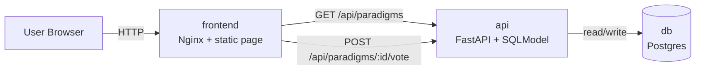
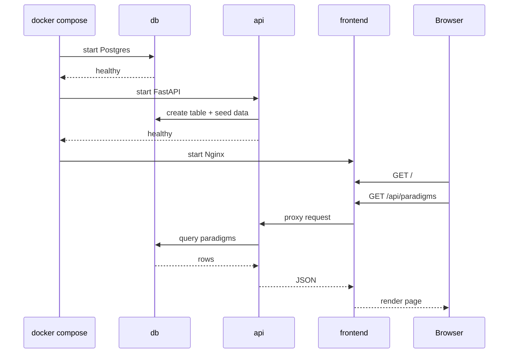
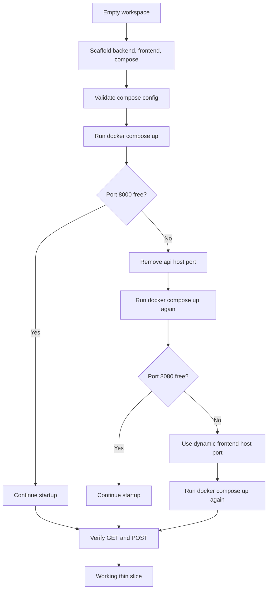
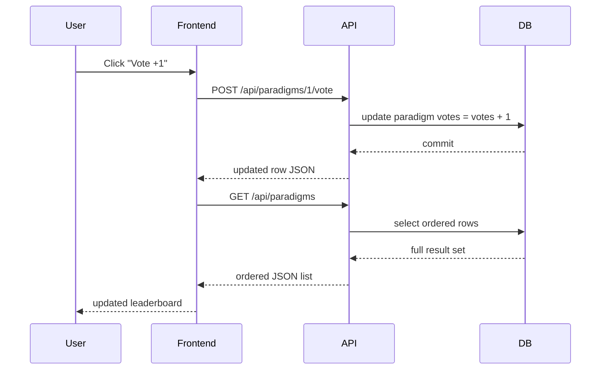

# Dev Paradigm Showdown Build Trace

This document traces how the app was built during the session, from an empty workspace to a working Docker Compose microservices slice.

## Goal

Build a very small, working system with:

- 1 page
- 2 API calls
- 1 database table
- simple microservices layout
- one-command startup with Docker Compose

## Final Shape

The finished stack is intentionally narrow:

- `frontend`: static HTML, CSS, and JavaScript served by Nginx
- `api`: FastAPI + SQLModel service
- `db`: Postgres service

Only the frontend is published to the host. The frontend proxies `/api/*` to the backend service over the Compose network.

## Figure 1: Final Architecture



## What Was Built

### Backend

The backend was created as a single file service:

- [backend/main.py](./backend/main.py)
- [backend/Dockerfile](./backend/Dockerfile)
- [backend/requirements.txt](./backend/requirements.txt)

It handles:

- database connection via `DATABASE_URL`
- table creation on startup
- seed data on first run
- `GET /api/paradigms`
- `POST /api/paradigms/{id}/vote`
- `GET /health`

### Frontend

The frontend was kept simpler than the original React proposal so the thin slice would stay reliable in Docker:

- [frontend/index.html](./frontend/index.html)
- [frontend/app.js](./frontend/app.js)
- [frontend/styles.css](./frontend/styles.css)
- [frontend/nginx.conf](./frontend/nginx.conf)
- [frontend/Dockerfile](./frontend/Dockerfile)

It:

- fetches the list on load
- sends vote requests
- re-fetches after voting
- proxies `/api` through Nginx so the browser never needs to know the backend host

### Orchestration

The services are wired together in:

- [docker-compose.yml](./docker-compose.yml)

It defines:

- service startup order
- health checks
- database volume
- frontend port publishing

## Figure 2: Service Startup Flow



## Session Trace

### 1. Started with an empty workspace

The workspace had no project files yet. That changed the task from "adjust an app" to "scaffold the full thin slice from scratch."

Decision:

- create the whole project layout directly
- avoid dependencies on any existing local setup

### 2. Confirmed the local toolchain

The environment was checked for:

- Docker
- Python
- Node

Result:

- Docker was available
- Python was available
- Node was available

That made a Compose-first implementation practical.

### 3. Simplified the original stack shape

The original suggestion used Vite + React. During implementation, the frontend was reduced to static HTML/JS behind Nginx.

Reason:

- fewer moving parts
- no separate Node dev server inside Compose
- easier one-command startup
- still fully satisfies the thin-slice goal

### 4. Built the backend service

The API service was designed to own all application behavior:

- define the `Paradigm` table
- connect to Postgres
- create schema on startup
- seed the initial options
- expose the two required API calls

### 5. Built the frontend service

The frontend was built as one page with:

- a heading and short subhead
- one card per paradigm
- vote button per card
- status messaging

It talks only to relative `/api/...` paths.

### 6. Added Docker Compose

Compose was used to connect:

- `db`
- `api`
- `frontend`

Health checks were added so startup order was meaningful instead of optimistic.

### 7. Validated the Compose file before startup

`docker compose config` was used first to catch structural issues early.

Result:

- configuration expanded correctly
- service graph looked valid

### 8. Hit a real port conflict on `8000`

The first startup failed because host port `8000` was already in use.

Fix:

- removed published host ports for `api`
- kept the API internal to Compose

This was the right design anyway, because the frontend proxies requests to the API and the browser does not need direct backend access.

### 9. Hit a second real port conflict on `8080`

The next startup failed because host port `8080` was also already in use.

Fix:

- changed the frontend port mapping to `80` only
- let Docker pick any free host port dynamically

That made the stack portable on a machine with existing local services already running.

### 10. Brought the stack up successfully

After those changes:

- `db` became healthy
- `api` became healthy
- `frontend` started

At the end of the session, Docker assigned the frontend to host port `57881`.

## Figure 3: Decision and Fix Flow



## End-to-End Verification

The system was verified with live HTTP checks against the running containers.

### Verification 1: frontend served HTML

Request:

- `GET /`

Result:

- returned the built page markup

### Verification 2: seeded data loaded through the frontend proxy

Request:

- `GET /api/paradigms`

Result:

- returned the 3 seed rows
- list was ordered by vote count, then name

### Verification 3: vote mutation worked

Request:

- `POST /api/paradigms/1/vote`

Result:

- vote count incremented for Functional Programming

### Verification 4: follow-up read reflected the write

Request:

- `GET /api/paradigms`

Result:

- Functional Programming moved to the top with `1` vote

## Figure 4: Request Lifecycle



## Why This Shape Worked

The implementation worked because it kept the boundaries sharp:

- Postgres owns persistence
- FastAPI owns data rules and mutation
- Nginx serves the page and forwards API calls
- the browser only talks to one origin

That reduced configuration overhead and avoided unnecessary CORS complexity.

## Tradeoffs Chosen Intentionally

### Chosen

- static frontend instead of React
- internal-only API service
- dynamic host port for frontend
- startup health checks

### Deferred

- authentication
- tests
- migrations
- live hot reload for frontend
- richer UI state management

## Visual Summary

```text
┌──────────────┐        HTTP         ┌─────────────────────┐
│    Browser   │ ─────────────────▶ │ frontend (Nginx)    │
└──────────────┘                    │ serves 1 page       │
                                    │ proxies /api/*      │
                                    └─────────┬───────────┘
                                              │
                                              │ internal Compose network
                                              ▼
                                    ┌─────────────────────┐
                                    │ api (FastAPI)       │
                                    │ 2 endpoints         │
                                    │ create + seed table │
                                    └─────────┬───────────┘
                                              │
                                              ▼
                                    ┌─────────────────────┐
                                    │ db (Postgres)       │
                                    │ 1 table             │
                                    └─────────────────────┘
```

## Key Outcome

The session produced a working microservices thin slice that:

- starts with one Compose command
- survives common local port conflicts
- stores votes in Postgres
- exposes two API calls
- serves one clean page through a single browser entrypoint
