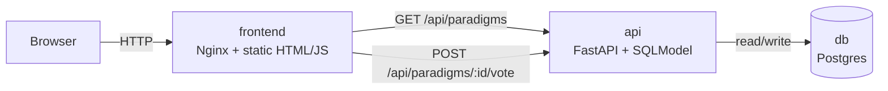

# Dev Paradigm Showdown

`Dev Paradigm Showdown` is a deliberately small microservices demo: one page, one table, two API calls, three containers.

The app lets users vote between software paradigms:

- Functional Programming
- Object-Oriented Programming
- Event-Driven Architecture

The point of the project is not feature depth. The point is to validate a stack end to end with the smallest slice that still feels real.

## Why This Repo Exists

This repository is designed as a teaching artifact for two things:

- how to build a thin software slice with Docker Compose and clean service boundaries
- how an AI coding agent works through a tool harness to inspect an environment, edit code, run validation, and recover from failures

## Architecture



## Stack

- `frontend`: Nginx serving one static page
- `api`: FastAPI + SQLModel
- `db`: Postgres 16
- `orchestration`: Docker Compose

## Minimal Stack

- `frontend`: static HTML served by Nginx and reverse-proxies `/api` to the backend
- `api`: FastAPI talking to a local SQLite table stored in `backend/paradigms.db`
- `volumes`: Compose mounts a named `backend_data` volume so the SQLite file survives restarts
- no external database—this keeps the stack as lean as possible

## Project Layout

```text
.
├── backend/
│   ├── Dockerfile
│   ├── main.py
│   └── requirements.txt
├── frontend/
│   ├── Dockerfile
│   ├── app.js
│   ├── index.html
│   ├── nginx.conf
│   └── styles.css
├── docker-compose.yml
├── AI_AGENT_TRACE.md
├── scripts/
│   └── e2e_smoke.py
└── README.md
```

## Run

Start the stack:

```bash
docker compose up --build
```

Find the published frontend port:

```bash
docker compose port frontend 80
```

Then open the returned address in your browser.

## API

- `GET /api/paradigms`
- `POST /api/paradigms/{id}/vote`

## Validation

Bring the stack up, then run the smoke test:

```bash
docker compose up --build -d
python3 scripts/e2e_smoke.py
```

The smoke test validates:

- the UI HTML is served
- the paradigms list loads through the frontend proxy
- a vote can be submitted
- the follow-up fetch reflects the database write

## Simplified Docker Model

- `api` builds from `backend/`, writes `paradigms.db`, and responds to `/api/paradigms` and `/api/paradigms/{id}/vote`
- `frontend` builds from `frontend/` and proxies all `/api` traffic
- `backend_data` volume stores the SQLite database so votes persist across restarts

There is zero extra service wiring: just two containers and one volume.

## Notes On Networking

Only the frontend is published to the host.

- the browser talks to the frontend
- the frontend proxies `/api/*` to the backend
- the backend talks to Postgres on the internal Compose network

This keeps the browser configuration simple and avoids CORS setup.

## Documentation

- [AI_AGENT_TRACE.md](./AI_AGENT_TRACE.md): the main deep-dive document for how the agent, prompt stack, tool harness, runtime feedback, and validation loop produced the final solution

## What Makes This A Thin Slice

- one table
- two endpoints
- one UI page
- persistent storage
- real network boundaries
- real startup orchestration
- live end-to-end verification

That is enough surface area to test whether the stack is coherent without overbuilding the product.
