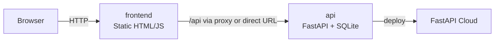

# Dev Paradigm Showdown

`Dev Paradigm Showdown` is a deliberately small thin-slice demo: one page, one table, two API calls, and a backend that can run locally or on FastAPI Cloud.

The app lets users vote between software paradigms:

- Functional Programming
- Object-Oriented Programming
- Event-Driven Architecture

The point of the project is not feature depth. The point is to validate a stack end to end with the smallest slice that still feels real.

## Why This Repo Exists

This repository is designed as a teaching artifact for two things:

- how to build a thin software slice with Docker Compose and clean service boundaries
- how an AI coding agent works through a tool harness to inspect an environment, edit code, run validation, and recover from failures

## Architecture



## Stack

- `frontend`: static HTML/JS, served by Nginx in Docker or `python -m http.server` locally
- `api`: FastAPI + SQLite
- `cloud`: FastAPI Cloud for backend deployment
- `orchestration`: Docker Compose plus small local helper scripts

## Minimal Stack

- `frontend`: static HTML served by Nginx and reverse-proxies `/api` to the backend
- `api`: FastAPI talking to a local SQLite table stored in `backend/paradigms.db`
- `volumes`: Compose mounts a named `backend_data` volume so the SQLite file survives restarts
- no external database—this keeps the stack as lean as possible
- `frontend` can also call the deployed FastAPI Cloud backend directly when run locally

## Project Layout

```text
.
├── backend/
│   ├── Dockerfile
│   ├── main.py
│   └── requirements.txt
├── frontend/
│   ├── Dockerfile
│   ├── app.js
│   ├── index.html
│   ├── nginx.conf
│   └── styles.css
├── docker-compose.yml
├── AI_AGENT_TRACE.md
├── scripts/
│   ├── _backend_common.sh
│   ├── deploy_backend.sh
│   ├── e2e_smoke.py
│   ├── run_backend_dev.sh
│   └── run_frontend.sh
└── README.md
```

## Modes

### 1. Full local Docker mode

Run the frontend through Nginx and proxy `/api` to the local backend:

```bash
docker compose up --build
```

Then find the published frontend port:

```bash
docker compose port frontend 80
```

Then open the returned address in your browser.

The Docker frontend also exposes the backend selector in the UI. By default it starts on the local Docker backend and also offers the deployed FastAPI Cloud backend.

### 2. Local frontend + local FastAPI dev backend

Run the backend in FastAPI dev mode:

```bash
./scripts/run_backend_dev.sh
```

In a second terminal, run the frontend against that local backend:

```bash
./scripts/run_frontend.sh local
```

Open `http://127.0.0.1:3000`.

The UI now includes a backend selector, so once the page is open you can switch between:

- the local FastAPI backend
- the deployed FastAPI Cloud backend

### 3. Local frontend + deployed FastAPI Cloud backend

Run the frontend locally, but point it at the deployed backend:

```bash
./scripts/run_frontend.sh cloud
```

Open `http://127.0.0.1:3000`.

This starts with the cloud backend selected by default, but the UI selector still lets you switch back to the local backend.

You can also point the frontend at any custom backend URL:

```bash
./scripts/run_frontend.sh https://your-api.example.com
```

Important:

- the deployed backend should use a shared database through `DATABASE_URL`
- local SQLite is fine for local mode, but it is not reliable behind a cloud load balancer
- if `DATABASE_URL` is not configured in FastAPI Cloud, mutation tests can fail because different requests may hit different app instances

### 4. Deploy the backend

Deploy the backend directory to FastAPI Cloud from the repo root:

```bash
./scripts/deploy_backend.sh
```

To deploy to a different app ID:

```bash
./scripts/deploy_backend.sh YOUR_APP_ID
```

If you want the deployed mode to behave consistently, configure `DATABASE_URL` in FastAPI Cloud to point to Neon, Supabase, or another shared Postgres instance before relying on vote persistence.

### 5. Test both modes

Run one command to verify:

- local frontend -> local FastAPI dev backend
- local frontend -> deployed FastAPI Cloud backend

```bash
./scripts/test_backend_modes.sh
```

## API

- `GET /api/paradigms`
- `POST /api/paradigms/{id}/vote`

## Validation

Validate the Docker mode:

```bash
docker compose up --build -d
python3 scripts/e2e_smoke.py
```

Validate the local frontend mode by pointing the smoke test at a specific base URL:

```bash
E2E_BASE_URL=http://127.0.0.1:3000 python3 scripts/e2e_smoke.py
```

The smoke test validates:

- the UI HTML is served
- the paradigms list loads through the configured backend target
- a vote can be submitted
- the follow-up fetch reflects the database write

## Simplified Docker Model

- `api` builds from `backend/`, writes `paradigms.db`, and responds to `/api/paradigms` and `/api/paradigms/{id}/vote`
- `frontend` builds from `frontend/` and can either proxy `/api` traffic or call a configured backend URL directly
- `backend_data` volume stores the SQLite database so votes persist across restarts

There is zero extra service wiring: just two containers and one volume.

## Notes On Networking

Docker mode keeps the browser on one origin:

- the browser talks to the frontend
- the frontend proxies `/api/*` to the backend
- the backend uses SQLite on the container filesystem plus the named volume

Local frontend mode calls the backend directly:

- the browser talks to the local static frontend server
- the frontend calls the backend by absolute URL
- the backend enables CORS for common local dev origins such as `http://127.0.0.1:3000`

## Documentation

- [AI_AGENT_TRACE.md](./AI_AGENT_TRACE.md): the main deep-dive document for how the agent, prompt stack, tool harness, runtime feedback, and validation loop produced the final solution

## What Makes This A Thin Slice

- one table
- two endpoints
- one UI page
- persistent storage
- real network boundaries
- real startup orchestration
- live end-to-end verification

That is enough surface area to test whether the stack is coherent without overbuilding the product.
